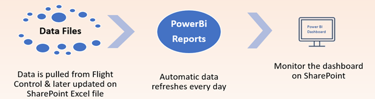

# CommScope-Project-2

### Automate dashboard to visualize 3 different product lines to get insights in PowerBi

**Issue:**  The current reporting process was done using excel which takes the Senior Engineer at TJ about 6 hours of his time every week, and the worst part is that the engineer had to work during weekends just to create this report. Who likes working on weekends? ☹

So I came acrross this workflow for this problem 

**Current workflow**

 
