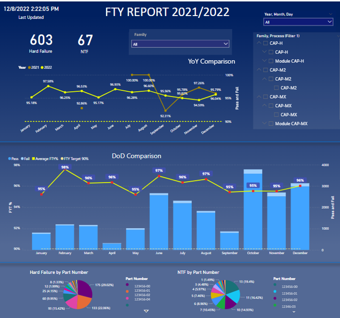

# Root Cause analysis using data blending techniques in Power BI

### Automate dashboard to visualize 3 different product lines to get insights in PowerBi

**Issue:**  The current reporting process was done using excel which takes the Senior Engineer at Tijuana,Mexico about 6 hours of his time every week, and the worst part is that the engineer had to work during weekends just to create this report. Who likes working on weekends? ☹

So I came acrross this workflow for this problem 

**Current workflow**

 

-----
_**Improvement in First Pass Yields:**_

-----

_**Power Bi Dashboard:**_

_**Key takeaways from this project**_

I was responsible for deploying this automated system and training senior engineering team members. The deployment of the system required careful planning and coordination with different teams to ensure a smooth transition.   I had to ensure that all necessary systems and infrastructure were in place before deployment, and that the system was tested thoroughly to eliminate any potential issues.   This required me to have a strong understanding of the system and its functionality, as well as the ability to communicate effectively with team members who may have different levels of technical expertise.   I was able to work with a diverse team of professionals and learn from their experiences, and I believe that the skills and knowledge I gained will be valuable in future projects.  
Also, during this process I was able to save time for someone who had been doing these manual work for years :) 
